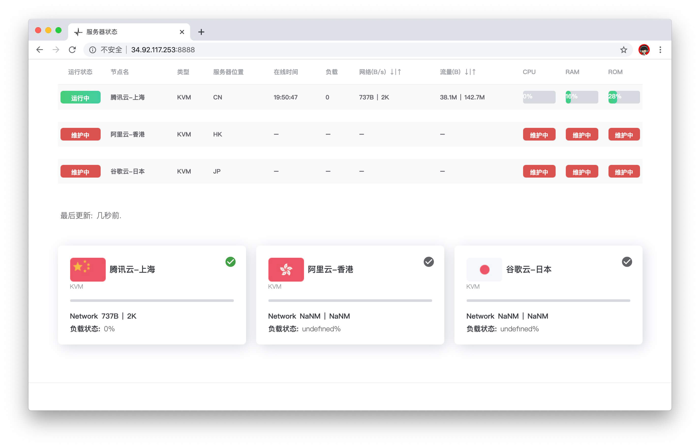

# serverstatus

GitHub [stilleshan/dockerfiles](https://github.com/stilleshan/dockerfiles)  
Docker [stilleshan/serverstatus](https://hub.docker.com/r/stilleshan/serverstatus)
> *docker image support for X86 and ARM*

## 简介
基于 [ToyoDAdoubi/ServerStatus-Toyo](https://github.com/ToyoDAdoubi/ServerStatus-Toyo) 一键脚本项目,并整合网友制作的 [美化主题](https://www.hostloc.com/thread-494384-1-1.html) 的 docker 镜像.
> *docker image support for X86 and ARM*

## 更新
**2021-06-06** 更新`2.0`版 docker 镜像,新增同时支持 X86 和 ARM 架构.

## 部署
具体部署及使用教程参考: [stilleshan/ServerStatus](https://github.com/stilleshan/ServerStatus)

## 参考
GitHub [stilleshan/ServerStatus](https://github.com/stilleshan/ServerStatus)

